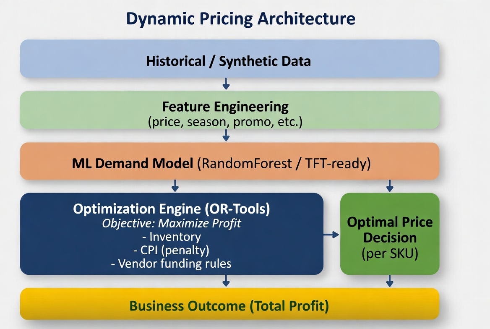

# System Architecture

## Flow

```text
Data → ML Model → Demand Prediction → Optimization → Decision
```

---

## Components

### 1. Data Layer

* Historical pricing data

### 2. ML Layer

* Predict demand

### 3. Optimization Layer

* Solve constrained problem

### 4. Decision Layer


## Architecture Diagram :


* Output optimal prices

                    ┌──────────────────────────┐
                    │   Historical / Synthetic │
                    │          Data            │
                    └────────────┬─────────────┘
                                 │
                                 ▼
                    ┌──────────────────────────┐
                    │   Feature Engineering    │
                    │ (price, season, promo)   │
                    └────────────┬─────────────┘
                                 │
                                 ▼
                    ┌──────────────────────────┐
                    │   ML Model (Demand)      │
                    │ RandomForest / TFT-ready │
                    └────────────┬─────────────┘
                                 │
                                 ▼
                    ┌──────────────────────────┐
                    │  Demand Predictions      │
                    └────────────┬─────────────┘
                                 │
                                 ▼
        ┌──────────────────────────────────────────────┐
        │        Optimization Engine (OR-Tools)        │
        │----------------------------------------------│
        │ Objective: Maximize Profit                   │
        │ Constraints:                                 │
        │  - Inventory                                 │
        │  - CPI (penalty)                             │
        │  - Vendor funding rules                      │
        └────────────┬─────────────────────────────────┘
                     │
                     ▼
        ┌──────────────────────────┐
        │   Optimal Price Decision │
        │   (per SKU)              │
        └────────────┬─────────────┘
                     │
                     ▼
        ┌──────────────────────────┐
        │     Simulator Layer      │
        │ Profit, Demand, Vendor   │
        └────────────┬─────────────┘
                     │
                     ▼
        ┌──────────────────────────┐
        │   Business Outcome       │
        │   (Total Profit)         │
        └──────────────────────────┘

